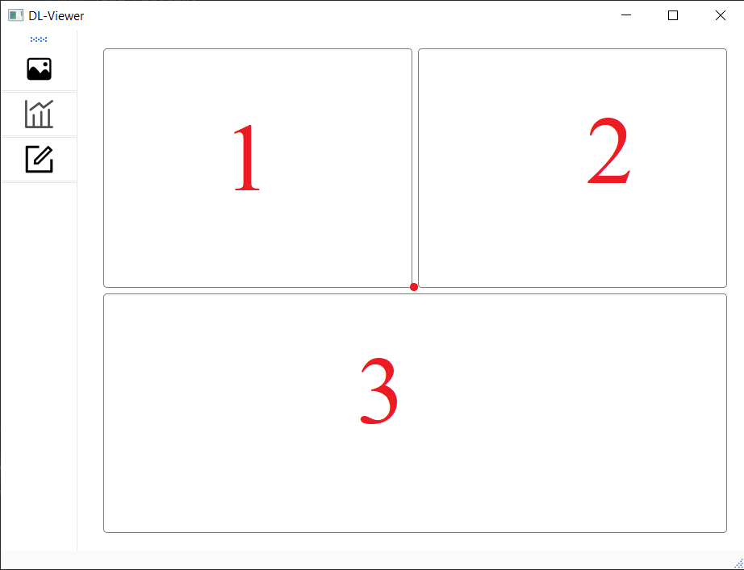
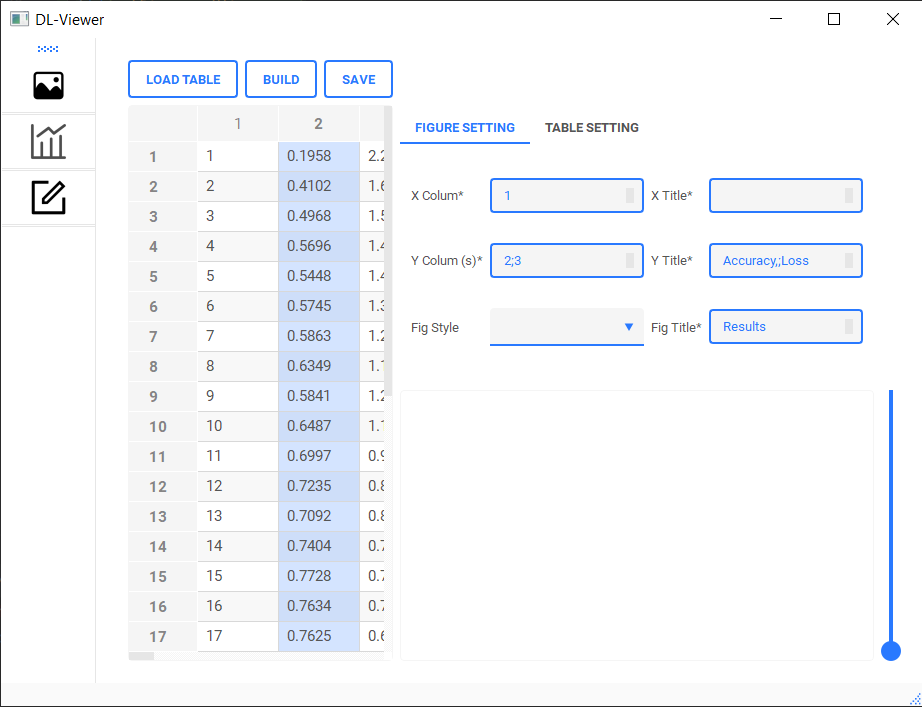
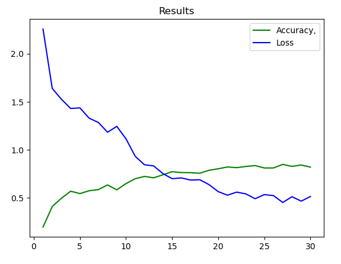
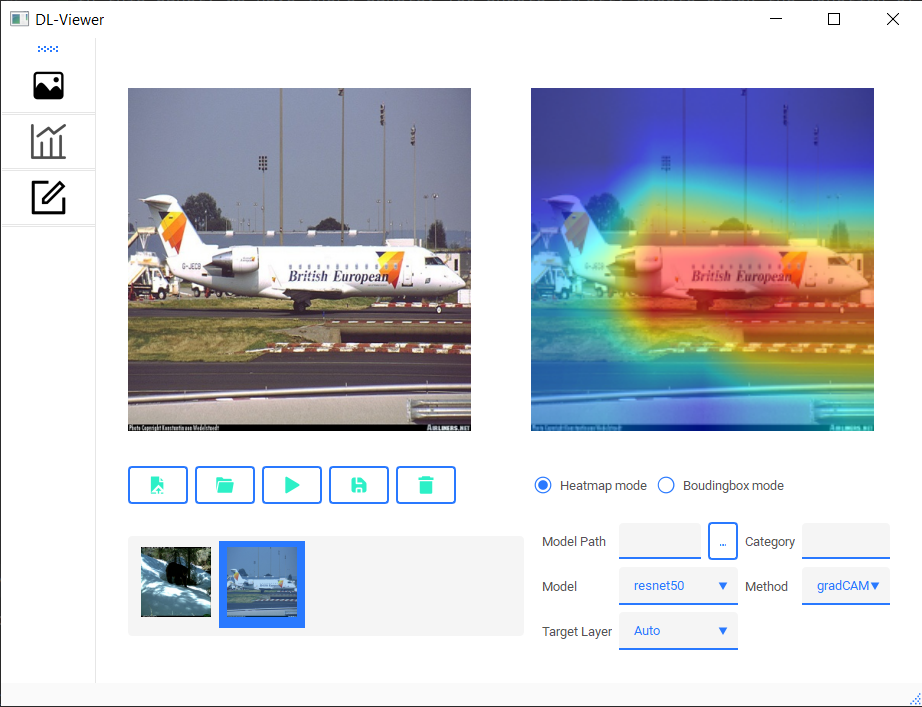

# DL-Viewer
A Deep Learning Viewer Tools for image viewer, data anlysis, edit, plot and so on. Implemented by PyQt Tools and Pytorch.

- [Introduction](#Introduction)
- [Instruction](#Instruction)
------------

## Introduction
### Fuctions:
- Drag and drop multiple pictures or pictures in folders and display them.
- Auto Resize and grid layout the pictures.
- Parse files data log and then plot curve figure.
- Generate heatmaps for common models or custom models.

### Todo Fuction:
- Multi style chart drawing.
- Analysis of data set, e.g., class number and data distribution.
- Faster heatmap generazation.
- Review, pick images and generate image paths txt file. 

## Instruction
#### 1. Install required packages.
``` python
pip install -r requirements.txt
```

#### 2. Fuction Area 1: View



In this panel, we have there panels. You should firstly double click the junction of the three panels to calibrate due to different computer resolution ratio. Then you can adjust the size of each panel.

You can drag and drop images or directory to panel 1, use "+" or "-" to zoom in or out images. Select specific image and use "←" or "→" keys to adjust its position. Use "Delete" to delete useless image. Finally, you will get suitable well-ranged images and you can screenshot it as your paper image or weekly report content. Like below image. Sounds useless, haha~


More interesting functions such as images selection, txt generation, dataset analysis will be added.


#### 2. Fuction Area 2: Plot
In this area, you can use "Load Table" button to load your model train log. Use "Delete" to delete useless columns or rows. Assign your Figure information in "Figure setting". Assign load details in Table Setting. Then use "Build" to generate curve figures.

    



#### 2. Fuction Area 3: Edit
In this area, you can load several images and generate heatmaps for them in "heatmap mode". You can also load your pretrained weights in "model path". Set target category for "gradCAM" method. Then use build or just simply select your target image in images gallery.Then the heatmap will be generated. Further, it also support upload your "custom" model. However, if your model is OrderedDict instead of Module, you should declare your model definition code in "lib/utils.py". You can set target layer manually by set "Target Layer" as manual.


